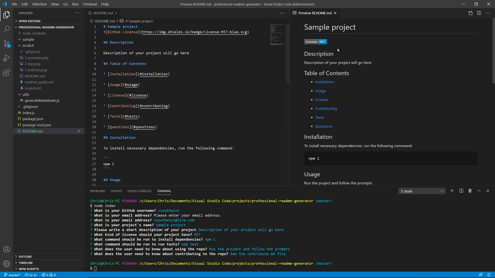

# Professional Readme Generator

## Description

Takes user input from the command-line and outputs a README.md file. Made with Node.js and Inquirer

## Installation

To install necessary dependencies, run the following command:

```
npm i
```

## Usage

Run the index file using Node.js and follow the prompts or click the image below to view a demonstration video

[](https://drive.google.com/file/d/1AppJVYIbTr0oVIo6MwqMdwyssa7rKICT/view)
